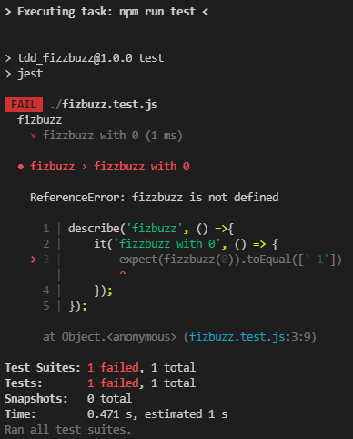
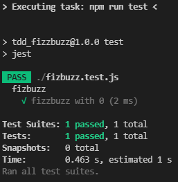
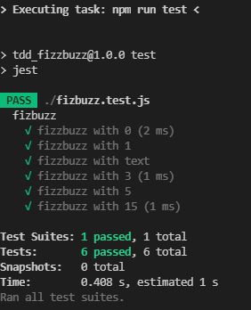

# TDD Approach For FizzBuzz

## **First Step - Write Test**
Create a basic test that should fail in this case testing with 0 and expecting ['-1']

*git checkout firstTestFail*

```javaScript
describe('fizbuzz', () =>{
    it('fizzbuzz with 0', () => {
        expect(fizzbuzz(0)).toEqual(['-1'])
    });
});
```


It should fail since there is not a fizzbuzz function anywhere on the project

## **Second Step -  Refactor the code to pass the test**
Just returning ['-1'] will pass all the tests so just do it without over engineering 

*git checkout firstTestPass*

```javaScript
function fizzbuzz(number){
    return ['-1']    
}
export default fizzbuzz
```



Test passes with refactored code imported on *.test.js

---
## **Then - Add another test that fails**
Test with a valid number so returning ['-1'] is not enough

*git checkout secondTestFail*

```javaScript
it('fizzbuzz with 1', () => {
    expect(fizzbuzz(1)).toEqual(['1'])
});  
```
### **Refactor the code to pass the test**
Just returning ['-1'] is not enough so add a check the just return the number to pass the test

*git checkout secondTestPass*

```javaScript
function fizzbuzz(number){
if(number <= 0){
    return ['-1']
}

return [number.toString()]
}
```
---
### **Repeat adding tests**
Test with a text so returning ['1'] or checking if number is less then 0 not enough

*git checkout thirdTestFail*

```javaScript
it('fizzbuzz with text', () => {
    expect(fizzbuzz('text')).toEqual(['-1'])
});  
```

#### **Refactor the code to pass the test**
Have to check type of the input so we can return ['-1'] to indicate failed input and pass the tests

*git checkout thirdTestPass*

```javaScript
function fizzbuzz(number){
    ...   
    if(typeof(number) != typeof(0)){
        return ['-1']
    }

    if(number <= 0){
        return ['-1']
    }
    ...
}
```

---
### **Add more tests**
Test with a bigger number so simply returning ['1'] is not enough

*git checkout fourthTestFail*

```javaScript
it('fizzbuzz with 3', () => {
    expect(fizzbuzz(3)).toEqual(['1','2','fizz'])
});  
```

#### **Refactor the code to pass the test**
Now just returning a single value is not enough and we have to add fizz if number is divisible by 3

*git checkout fourthTestPass*

```javaScript
function fizzbuzz(number){
    ...
    for (let x=1 ; x<=number ; x+=1) {
        let appends = ''
        if(x % 3 === 0){
            appends = 'fizz'
        }else{
            appends = x.toString()
        }
        arr.push(appends)
    }
    return arr
}
```
---
### **More tests**
Test with another condition

*git checkout fifthTestFail*

```javaScript
it('fizzbuzz with 5', () => {
    expect(fizzbuzz(5)).toEqual(['1','2','fizz','4','buzz'])
});  
```

#### **Refactor the code to pass the test**
Now we have to check if number is divisible by 5 to add buzz to the list instead of 5

*git checkout fifthTestPass*

```javaScript
function fizzbuzz(number){
    ...
    for (let x=1 ; x<=number ; x+=1) {
        let appends = ''
        if(x % 3 === 0){
            appends = 'fizz'
        }else if(x % 5 === 0){
            appends = 'buzz'
        }else{
            appends = x.toString()
        }
        arr.push(appends)
    }
    return arr
}
```
---
### **More tests**
Test with another condition to make it fail

*git checkout sixthTestFail*

```javaScript
it('fizzbuzz with 15', () => {
    expect(fizzbuzz(15)).toEqual(['1','2','fizz','4','buzz','fizz','7','8','fizz','buzz','11','fizz','13','14','fizzbuzz'])
});  
```

#### **Refactor the code to pass the test**
Lastly we need to check if number is divisible by 3 and 5 at the same time by checking if it can be divided by 15 first

*git checkout sixthTestPass*

```javaScript
function fizzbuzz(number){
    ...
    for (let x=1 ; x<=number ; x+=1) {
        let appends = ''
        if(x % 15 === 0){
            appends = 'fizzbuzz'
        }else if(x % 3 === 0){
            appends = 'fizz'
        }else if(x % 5 === 0){
            appends = 'buzz'
        }else{
            appends = x.toString()
        }
        arr.push(appends)
    }
    return arr
}
```
---


# **Add more tests that fails then refactor the code even more to pass the tests**